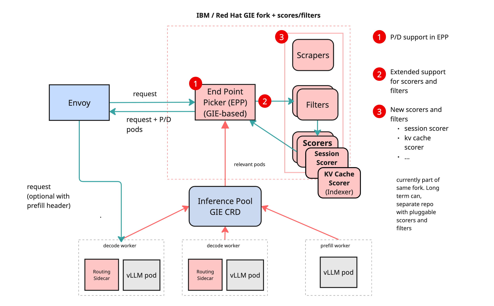
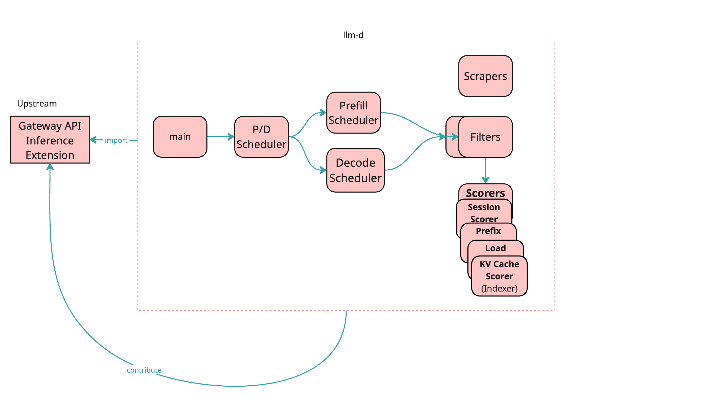

# llm-d Inference Router Architecture

## Overview

**llm-d** is an extensible architecture designed to route inference requests efficiently across model-serving pods. A central component of this architecture is the **Inference Gateway**, which builds on the Kubernetes-native **Gateway API Inference Extension (GIE)** to enable scalable, flexible, and pluggable routing of requests.

The design enables:

- Support for **multiple base models** and **LoRA adapters** within a shared cluster [Not supported in
Phase1]
- Efficient routing based on **KV cache locality**, **prefix**, **session affinity**, **load**, and
**model metadata**
- Disaggregated **Prefill/Decode (P/D)** execution
- Pluggable **filters**, **scorers**, and **scrapers** for extensible routing

---

## Core Goals

- Route inference requests to optimal pods based on:
  - Base model compatibility
  - KV cache reuse
  - Load balancing
- Support multi-model deployments on heterogeneous hardware
- Enable runtime extensibility with pluggable logic (filters, scorers, scrapers)
- Community-aligned implementation using GIE and Envoy + External Processing (EPP)

---

## Architecture Design



The inference scheduler is built on top of:

- **Envoy** as a programmable data plane
- **EPP (External Processing Plugin)** using **GIE**

### Pluggability



Routing decisions are governed by dynamic components:

- **Filters**: Exclude pods based on static or dynamic criteria
- **Scorers**: Assign scores to candidate pods
- **Scrapers**: Collect pod metadata and metrics for scorers

These components are maintained in the `llm-d-inference-scheduler` repository and can evolve independently.

---

## Filters, Scorers, and Scrapers

### Core Design Principles

- **Pluggability**: No core changes are needed to add new scorers or filters
- **Isolation**: Each component operates independently

### Routing Flow

1. **Filtering**
   - Pods in an `InferencePool` go through a sequential chain of filters
   - Pods may be excluded based on criteria like model compatibility, resource usage, or custom logic

2. **Scoring**
   - Filtered pods are scored using a weighted set of scorers
   - Scorers currently run sequentially (future: parallel execution)
   - Scorers access a shared datastore populated by scrapers

3. **Pod Selection**
   - The highest-scored pod is selected
   - If multiple pods share the same score, one is selected at random

### Lifecycle Hooks

- `Pre-call`
- `Scoring`
- `Post-choice`
- `After-response`

---

## Configuration

The set of lifecycle hooks (plugins) that are used by the inference scheduler is determined by how 
it is configured. The configuration is in the form of YAML text, which can either be in a file or
specified in-line as a parameter. The configuration defines the set of plugins to be instantiated along with their parameters. Each plugin is also given a name, enabling the same plugin type to be instantiated
multiple times, if needed. Also defined is a set of SchedulingProfiles, which determine the set of
plugins to be used when scheduling a request. The set of plugins instantiated must also include a
Profile Handler, which determines which SchedulingProfiles will be used for a particular request and
how their results will be processed.

The configuration text has the following form:
```yaml
apiVersion: inference.networking.x-k8s.io/v1alpha1
kind: EndpointPickerConfig
plugins:
- ....
- ....
schedulingProfiles:
- ....
- ....
```

The first two lines of the configuration are constant and must appear as is.

The plugins section defines the set of plugins that will be instantiated and their parameters. Each entry in this section
has the following form:
```yaml
- name: aName
  type: a-type
  parameters:
    parm1: val1
    parm2: val2
```
The fields in a plugin entry are:
- *name* which is optional, provides a name by which the plugin instance can be referenced. If this
field is omitted, the plugin's type will be used as its name.<br>
- *type* specifies the type of the plugin to be instantiated.<br>
- *parameters* which is optional, defines the set of parameters used to configure the plugin in question.
The actual set of parameters varies from plugin to plugin.

The schedulingProfiles section defines the set of scheduling profiles that can be used in scheduling
requests to pods. The number of scheduling profiles one defines, depends on the use case. For simple
serving of requests, one is enough. For disaggregated prefill, two profiles are required. Each entry
in this section has the following form:
```yaml
- name: aName
  plugins:
  - pluginRef: plugin1
  - pluginRef: plugin2
    weight: 50
```
The fields in a schedulingProfile entry are:
- *name* specifies the scheduling profile's name.
- *plugins* specifies the set of plugins to be used when this scheduling profile is chosen for a request.
Each entry in the schedulingProfile's plugins section has the following fields:
  - *pluginRef* is a reference to the name of the plugin instance to be used
  - *weight* is the weight to be used if the referenced plugin is a scorer.

A complete configuration might look like this:
```yaml
apiVersion: inference.networking.x-k8s.io/v1alpha1
kind: EndpointPickerConfig
plugins:
- type: prefix-cache
  parameters:
    hashBlockSize: 5
    maxPrefixBlocksToMatch: 256
    lruCapacityPerServer: 31250
- type: decode-filter
- type: max-score
- type: single-profile
schedulingProfiles:
- name: default
  plugins:
  - pluginRef: decode-filter
  - pluginRef: max-score
  - pluginRef: prefix-cache
    weight: 50
```

If the configuration is in a file, the EPP command line argument `--configFile` should be used to specify the full path of the file in question. If the configuration is passed as in-line text the EPP command
line argument `--configText` should be used.

### Plugin Configuration

This section describes how to setup the various plugins available with the llm-d-inference-scheduler

**PrefillHeader**<br>
Sets a header for use in disaggregated prefill/decode<br>
*Type*: prefill-header<br>
*Parameters*:<br>
\- `prefillProfile` specifies the name of the profile used for the prefill scheduling. Only needed if the 
   prefill profile is not named `prefill`.<br>

**PdProfileHandler**<br>
Selects the profiles to use when running with disagregated prefill/decode<br>
*Type:* pd-profile-handler<br>
*Parameters:*<br>
\- `threshold` specifies the threshold at which there are enough new input tokens to
    send the request to prefill and then decode, vs just to decode.<br>
\- `hashBlockSize` specifies the length of the prompt chunk that a block is keyed by.
   This must the same value used for the PrefixCachePlugin.<br>
\- `decodeProfile` specifies the name of the profile used for the decode scheduling.
   Only needed if the decode profile is not named `decode`.<br>
\- `prefillProfile` specifies the name of the profile used for the prefill scheduling.
   Only needed if the prefill profile is not named `prefill`.<br>
**Note:** When using this plugin you must also have a PrefixCachePlugin configured in the
   prefill and decode scheduling profiles.

**ByLabelSelector**<br>
Filters out pods using a standard Kubernetes label selector.<br>
**Note:** Only the matching laabels feature of Kubernetes label selectors is supported.<br>
*Type:* by-label-selector<br>
*Parameters:* A standard Kubernetes label selector.<br>
\- `matchLabels` is a map of {key,value} pairs. If more than one pair are in the map, all
of the keys are checked and the results are ANDed together.

**DecodeFilter**<br>
Filters out pods that are not marked either as decode or both prefill and decode. The filter
looks for the label `llm-d.ai/role`, with a value of either `decode` or `both`. In addition pods
that are missing the label will not be filtered out.<br>
*Type:* decode-filter<br>
*Parameters:* None<br>

**PrefillFilter**<br>
Filters out pods that are not marked as prefill. The filter looks for the label `llm-d.ai/role`,
with a value of `prefill`.<br>
*Type:* prefill-filter<br>
*Parameters:* None<br>

**KvCacheAwareScorer**<br>
Scores based on real KV-cache state on vLLM. It is more accurate than either the SessionAffinity
or PrefixCachePlugin, but requires extra computation and cycles to track the current cache state<br>
*Type:* kvcache-aware-scorer<br>
*Parameters:* Due to the sensitivity of the parameters of this plugin, the following
environment variables are used to configure the scorer:<br>
`KVCACHE_INDEXER_REDIS_ADDR` - the address of the Redis server used<br>
`HF_TOKEN` - the Hugginface token to be used.<br>

**LoadAwareScorer**<br>
Scores pods based on their load, based on the number of requests concurrently being processed.
A threshold is provided which is used to determine what is considered an overloaded pod.<br>
Scores are given to the pods in the range of 0-1. Currently the metrics contain the number of
requests waiting in the queue, there is no information about number of requests that can be
processed in the given pod immediately.<br>
Pods with an empty waiting requests queue are scored with 0.5.<br>
Pods with requests in the queue will get score between 0.5 and 0.<br>
*Type:* load-aware-scorer<br>
*Parameters:*<br>
\- `threshold` specifies the threshold at which a pod is considered overloaded.<br>

**SessionAffinity**<br>
Scores the candidate pods by giving a higher score to the pods that were previously
used for the same session.<br>
*Type:* session-affinity-scorer<br>
*Parameters:* None<br>

### Sample Disaggregated Prefill/Decode Configuration
The following is an example of what a configuration for disaggregated Prefill/Decode might look like:
```yaml
apiVersion: inference.networking.x-k8s.io/v1alpha1
kind: EndpointPickerConfig
plugins:
- type: prefill-header
- type: prefix-cache
  parameters:
    hashBlockSize: 5
    maxPrefixBlocksToMatch: 256
    lruCapacityPerServer: 31250
- type: prefill-filter
- type: decode-filter
- type: max-score
- type: pd-profile-handler
  parameters:
    threshold: 10
    hashBlockSize: 5
schedulingProfiles:
- name: prefill
  plugins:
  - pluginRef: prefill-filter
  - pluginRef: max-score
  - pluginRef: prefix-cache
    weight: 50
- name: decode
  plugins:
  - pluginRef: decode-filter
  - pluginRef: max-score
  - pluginRef: prefix-cache
    weight: 50
```

Several things should be noted:
1. The `PrefillHeader`, `PdProfileHandler`, `DecodeFilter`, `PrefillFilter` and the `PrefixCachePlugin`
plugins must be in the list of plugins instantiated.
2. There must be two scheduler profiles defined.
3. The scheduler profile for prefill, must include the `PrefillFilter`
4. The scheduler profile for decode, must include the `DecodeFilter`

---

## Metric Scraping

- Scrapers collect metrics (e.g., memory usage, active adapters)
- Data is injected into the shared datastore for scorers
- Scoring can rely on numerical metrics or metadata (model ID, adapter tags)

---

## Disaggregated Prefill/Decode (P/D)

When enabled, the router:

- Selects one pod for **Prefill** (prompt processing)
- Selects another pod for **Decode** (token generation)

The **vLLM sidecar** handles orchestration between Prefill and Decode stages. It allows:

- Queuing
- Local memory management
- Experimental protocol compatibility

> **Note**: The detailed P/D design is available in this document: [Disaggregated Prefill/Decode in llm-d](./dp.md)
---

## InferencePool & InferenceModel Design

### Current Assumptions

- Single `InferencePool` and single `EPP` due to Envoy limitations
- Model-based filtering can be handled within EPP
- Currently only one base model is supported

---

## References

- [GIE Spec](https://gateway-api-inference-extension.sigs.k8s.io/)
- [Envoy External Processing](https://www.envoyproxy.io/docs/envoy/latest/configuration/http/http_filters/ext_proc_filter)
